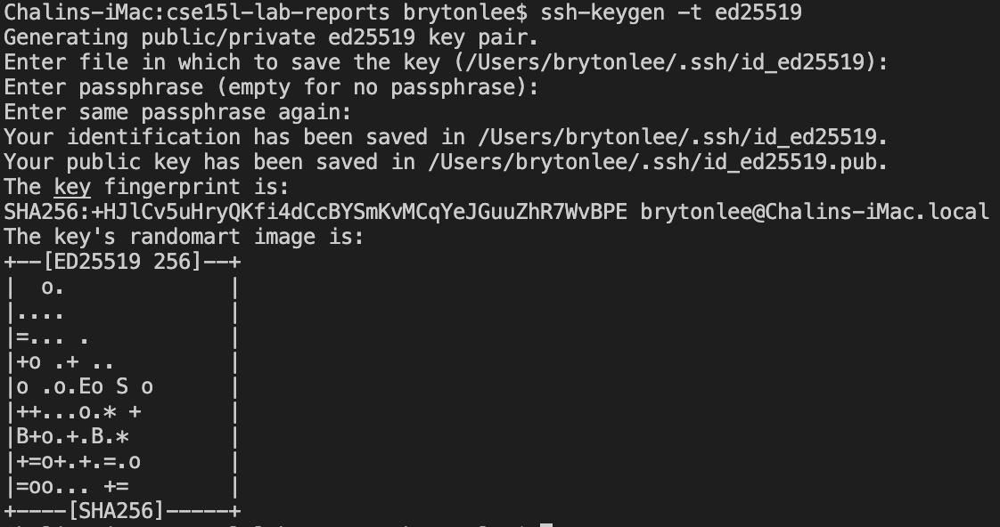

# Week 2 Lab 1 Report:

Test Links:

[Lab Report 1](lab-report-1-week-2.html)

[Lab Report 1](https://lbryton.github.io/cse15l-lab-reports/LabReport1/lab-report-1-week-2.html)

## **Setting up Visual Studio Code**

Go to this [*link*](https://code.visualstudio.com/) to download the Visual Studio Code version for your operating system (OSX for Macs and Windows for PCs). This page should appear:

After downloading and installing Visual Studio, open up the application, and you should be prompted with this screen:


## **Remotely Connecting to CSE course-specific accounts**

To remotely connect to your CSE course-specific account, you will have to go to this [*link*](https://sdacs.ucsd.edu/~icc/index.php). After signing in with your UC San Diego username and PID, you will find your course-specific account under **Additional Accounts**. Your account username may include the specific class and quarter you are taking this class. To use this account, you will have to create a password. When you change your password, make sure you pick only to change the course account. Otherwise, you will also change your passwords for your TritonLink account.  After setting up the password for the account, you can now remotely connect to the UC San Diego servers. By typing the command 

```ssh (account username)@ieng6.ucsd.edu```

 and then entering the password created, you can connect with the UC San Diego servers.


## **Running Some Commands**

After you have remotly connected to the UC San Diego servers, there are a few commands you could try out:
* `$ cd`: Used to change your directory.
* `$ ls`, `$ ls - lat`, and `$ ls -a`: Used to list out the files and directories of a specific directory.
* `$ pwd`: Used to print out the directory the user is at.
* `$ mkdir`: Used to create a directory.
* `$ cp`: Used to copy files or a directory.
* `$ scp`: Used to transfer data between two different systems (Server and Client for example).
* `$ cat`: Used to create and view files.


## **Moving Files with *scp***

One example of the use of scp is transferring files from your computer onto the remote computer. For example, you can copy the file WhereAmI.java from your computer to the remote server. First, go back to your computer's terminal using `$ exit` or creating a new terminal. Next, make a file, `WhereAmI.java`, and fill the program with the following code:

This program allows you to see where you are, whether you are on your computer or UCSD's servers. Try running this program on your computer and observe the results. Now run the command

```$ scp (file name) (account username)@ieng6.ucsd.edu:~/```

to copy the file onto the remote server (your UCSD terminal). 

Now log back into your UCSD terminal and try to run `WhereAmI.java`. You should now see the remote server's information like show below.


## **Setting up an SSH Key**

You can create a SSH Key to remove the process of typing in your account password everytime. You create your SSH Key by typing in ```$ ssh-keygen -t ed25519```. You can specify the location of where you would like the keys to be generated and the password for the keys. Make sure you remember your password, as it will be your login password when remotely connecting.


## **Optimizing Remote Running**

To use your SSH Key for optimizing your remote running, you will have to copy your key onto the directory of your server account. You will have to:
* Create a .ssh directory in your server account (```$ mkdir .ssh```)
* Then copy the public SSH Key into that directory from your computer:

```$ scp /Users/(username))/.ssh/id_rsa.pub (account username)@ieng6.ucsd.edu:~/.ssh/authorized_keys```


After setting up your SSH Key with your remote account, it be even easier to run commands remotely. By putting commands after calling for `$ ssh (account username)@ieng6.ucsd.edu` in quotes, you will be able to run commands on your remote account through your computer's terminal. 

Another useful trick is by placing semicolons between commands to seperate different lines of code within one line.


And there you have it. These are the basic steps to connect and use UCSD's remote server using VS Code.