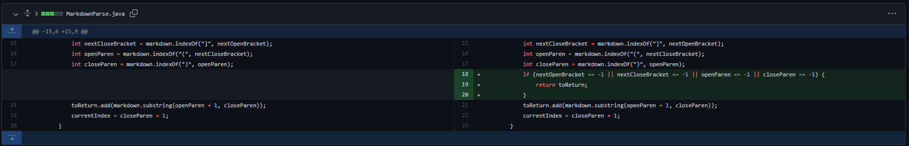
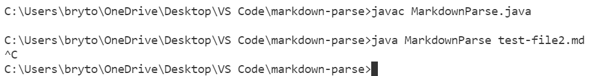

# Week 4 Lab 2 Report:

Lab Links:

[Lab Report 1](https://lbryton.github.io/cse15l-lab-reports/LabReport1/lab-report-1-week-2.html)

# Select Three Code Changes to Describe:

## 1. Error 1: 
> 
>
> This [test file](https://github.com/lbryton/markdown-parse/blob/main/testfile1.md) was the file that cause the failure-inducing input.
>
> Symptom of bug: Code runs in an infinite loop

>Description: 

## 2. Code Change 2:
> Bug: After finding the open an closed brackets, the code will search for the next pttteearathesis, no matter how far away the parathesis is from the closed bracket. 
>
> File that caused this problem to occur: [Test File 2](https://github.com/lbryton/markdown-parse/blob/main/testfile2.md)
>
> Symptom of bug: Code runs in an infinite loop

>Description:

## 3. Code Change 3:
> Bug: 
>
> File that caused this problem to occur: [Test File #]()
>
> Symptom of bug: 

>Description: