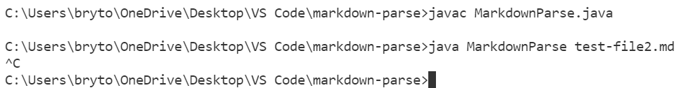
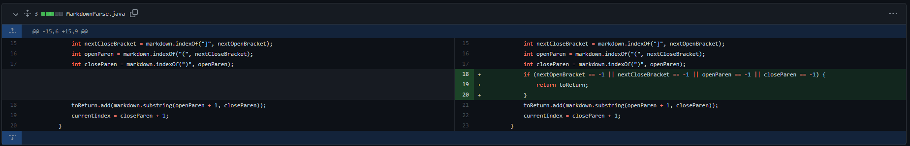
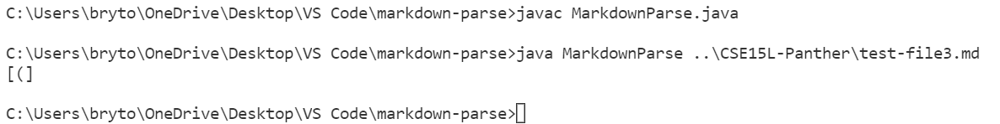

# Week 4 Lab 2 Report:
- This lab report is to describe 3 bug changes in MarkdownParse.java to remove incorrect ouputs

Lab Links:

1. [Lab Report 1](https://lbryton.github.io/cse15l-lab-reports/LabReport1/lab-report-1-week-2.html)

Pre Lab Notes:

1. Forked code with bug fixes [here](https://github.com/lbryton/markdown-parse)
2. Original code by Joe Politz [here](https://github.com/ucsd-cse15l-w22/markdown-parse)

## Error 1: Incorrect Checks for Indexes
> The first error my lab group decided to fix was when the values for  `nextOpenBracket`, `nextCloseBracket`, and `openParen` were `-1` (or the indexes of `[`,`]`, or `(`), the code would sometimes neglect these indicators. This was because the code would only check for `closeParen` to end the while loop. One symptom of this error is that the code would run in an infinite loop. When running this [test file](https://github.com/lbryton/markdown-parse/blob/main/testfile1.md), an example of this type of failure-inducing input, the results in the image below occur:

>The command line actions above depicted the needs to manually terminate the program to end the infinite loop.
To fix this error, I allowed the program to check if any of the values for `nextOpenBracket`, `nextCloseBracket`, and `openParen` and `closeParen` were `-1` to break out of the while loop:
>


## 2. Error 2: Distance Between Closed Bracket and Open Parentheses
> The next error my lab group decided to fix was the difference in index values from `nextCloseBracket`, and `openParen`. For a correctly formated link, the open parentheses comes right after the closed bracket. However, the original code will pick up the closed bracket and open parentheses in this failure-inducing input from this [test file](https://github.com/lbryton/markdown-parse/blob/main/testfile2.md). The contents for this file are show below:
>```
>For set we use brackets ([]) instead of >paratheses (())
>```
> Because there is no link in the test file, the program should return a blank `ArrayList`. However, the original code returns a `(` as shown below:
>
>To fix this issue, I made these changes to the original code.
>

## 3. Error 3:
> Bug: 
>
> File that caused this problem to occur: [Test File #]()
>
> Symptom of bug: 

>Description: