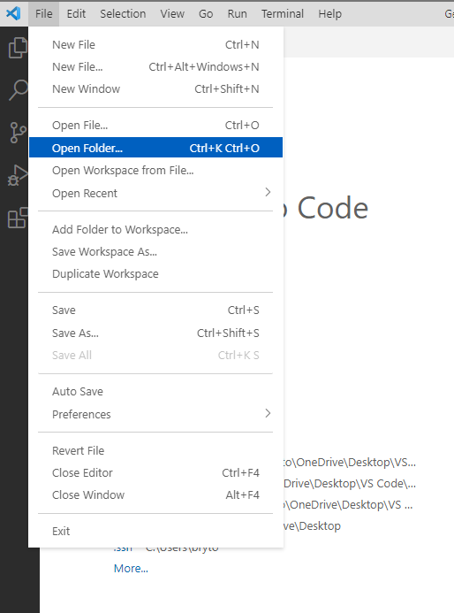
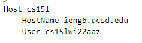
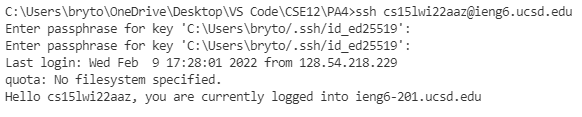
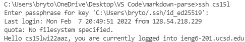
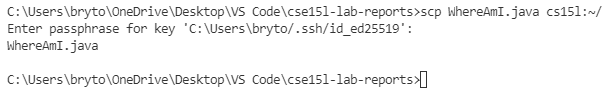

#  Lab 3 Week 6 Report:
- This lab report is to show one of the Group Choice Options from [week 5](https://ucsd-cse15l-w22.github.io/week/week5/#group-choice-1-streamline-ssh-configuration). The option described in this lab report is streamlining the ssh Configuration

Lab Links:
- [Index](https://lbryton.github.io/cse15l-lab-reports/index.html)
1. [Lab Report 1](https://lbryton.github.io/cse15l-lab-reports/LabReport1/lab-report-1-week-2.html)
2. [Lab Report 2](https://lbryton.github.io/cse15l-lab-reports/LabReport2/lab-report-2-week-4.html)
3. [Lab Report 4](https://lbryton.github.io/cse15l-lab-reports/LabReport4/lab-report-4-week-8.html)
4. [Lab Report 5](https://lbryton.github.io/cse15l-lab-reports/LabReport5/lab-report-5-week-10.html)

Pre Lab Notes:

1. Lab Report [here](https://ucsd-cse15l-w22.github.io/week/week6/#week-6-lab-report)

## Part 1: Show and Edit `.ssh/config` file
> The first part of streamlining the ssh configuration is locating the location of 
the .ssh directory and creating the config file in it. To get to the `.ssh` directory
on Visual Studio Code, you first go to the directory by clicking on Open Folder in the File tab as show below:
>
>
>
> Next, I located where my .ssh directory is and selected that folder. After moving
into the `.ssh` directory, I created a file named `config` to streamline my ssh and
wrote the following inside the `config` file:
>
>
>
> The `Host` is the name of the alias I chose, the `Hostname` is the domain of the 
remote server I ssh into, and the `User` is the username of my account in the 
remote server.

## Part 2: Using the `ssh` Command to Login With Configurated Alias
> To login to the remote server, I use my alias defined in the `.ssh/config` file 
instead of `(username)@(ieng6.ucsd.edu)`. Show below is the difference between having an alias and not having an alias:
>
> 
>> (Without an alias)
>
> 
>> (With an alias)
>
> As a result of configurating the alias, I am able to save myself time using short
aliases rather than writing out `(username)@(ieng6.ucsd.edu)`

## Part 3: Copying a File using `scp` Using Configurated Alias
> Similarly, I can use my configured alias for other terminal commands to interact with UCSD's remote server. One example is copying a file using the configured alias as shown below:
>
>
>
> Once again, I save myself time copying the file onto UCSD's remote server through `scp` by using my alias to streamline the remote process. 