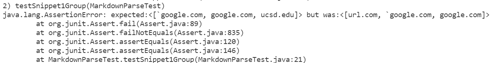
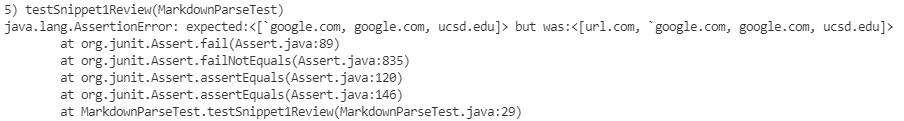
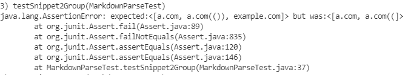
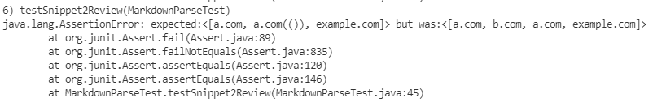
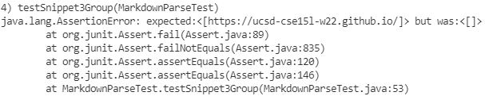
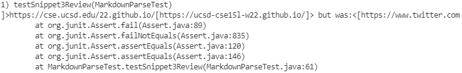

#  Lab 4 Week 8 Report:
- The purpose of this lab is to test if my groups code and the group that my group reviewed worked for certain examples. I will be testing each snippet with each java code and determine the possible solutions to my group's code.

Lab Links:
- [Index](https://lbryton.github.io/cse15l-lab-reports/index.html)
1. [Lab Report 1](https://lbryton.github.io/cse15l-lab-reports/LabReport1/lab-report-1-week-2.html)
1. [Lab Report 2](https://lbryton.github.io/cse15l-lab-reports/LabReport2/lab-report-2-week-4.html)
1. [Lab Report 3](https://lbryton.github.io/cse15l-lab-reports/LabReport3/lab-report-3-week-6.html)

Pre Lab Notes:

1. Lab Report [here](https://ucsd-cse15l-w22.github.io/week/week8/#week-8-lab-report)
2. Links:
- Link to my markdown-parse [repository](https://github.com/lbryton/markdown-parse)
- Link to reviewed markdown-parse [repository](https://github.com/ShashankVenkatramani/markdown-parse)
- Link to [Snippet1](https://github.com/lbryton/cs15lcode/blob/main/Lab4/Snippet1.md),
 [Snippet2](https://github.com/lbryton/cs15lcode/blob/main/Lab4/Snippet2.md),
  and [Snippet3](https://github.com/lbryton/cs15lcode/blob/main/Lab4/Snippet3.md)
- Link to [tester](https://github.com/lbryton/cs15lcode/blob/main/Lab4/MarkdownParseTest.java) and [code repository](https://github.com/lbryton/cs15lcode/tree/main/Lab4)

## Part 1: Testing Snippet 1 on Our Group's MarkdownParse 
- Did it pass: No
> Reason: There is no implementation in our group's code to determine if a possible link is an actual link if there are backticks. 
>
> Method of solution: I do not think that making a small (<10 line) code change will make my group's program work for snippet 1. This is because of how many cases that would have to be searched to make sure that backticks do not influence the link. This is because you would have to check for backticks inside and outside of each bracket and parentheses and would have to check if that backtick matched with one in the previous or next line's backtick. If I were to implement these features, I would create one method to pair up each backtick if possible and another to determine if the link is within an affected area and to determine what to do if it is. 

## Part 2: Testing Snippet 1 on Reviewed Group's MarkdownParse 
- Did it pass: No
> Reason: There is no implementation in our group's code to determine if a possible link is an actual link if there are backticks. 
>

## Part 3: Testing Snippet 2 on Our Group's MarkdownParse 
- Did it pass: No
> Reason: 
>
> Method of solution: I do not think that making a small (<10 line) code change will make my group's program work for snippet 2. Just like the backticks in snippet 1, there will also be many different cases for nested and escaped brackets and parentheses. If I were to implement these features, I would create one method to check for escaped brackets, a recursive methods to find nested brackets and another recursive method to find nested parentheses.

## Part 4: Testing Snippet 2 on Reviewed Group's MarkdownParse 
- Did it pass: No
> Reason: 
>

## Part 5: Testing Snippet 3 on Our Group's MarkdownParse 
- Did it pass: No
> Reason: 
>
> Method of solution: I think that it would be possible that making a small (<10 line) code change will make my group's program work for snippet 3. First I would replace the `containsSpace` variable and replace it with code that would trim off spaces before and after the link. For example: `"( abc )"` as a link to `[abc]` as a return for the `getLinks` method. The next thing I would do is create a method to determine if there are consecutive line spaces (two or more `\n`) within the link or link title and remove them if they exist to allow the code to get the links properly.

## Part 6: Testing Snippet 3 on Reviewed Group's MarkdownParse 
- Did it pass: No
> Reason: 
>