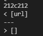
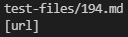
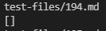
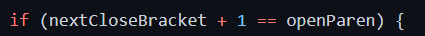
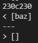
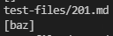
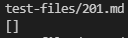

#  Lab 5 Week 10 Report:
- The purpose of this lab is to compare the differences in results between the outputs of our group's MarkdownParse and the MarkdownParse provided for Week 9.

Lab Links:
- [Index](https://lbryton.github.io/cse15l-lab-reports/index.html)
1. [Lab Report 1](https://lbryton.github.io/cse15l-lab-reports/LabReport1/lab-report-1-week-2.html)
2. [Lab Report 2](https://lbryton.github.io/cse15l-lab-reports/LabReport2/lab-report-2-week-4.html)
3. [Lab Report 3](https://lbryton.github.io/cse15l-lab-reports/LabReport3/lab-report-3-week-6.html)
4. [Lab Report 4](https://lbryton.github.io/cse15l-lab-reports/LabReport4/lab-report-4-week-8.html)

Pre Lab Notes:

1. Lab Report [here](https://ucsd-cse15l-w22.github.io/week/week10/#lab-report-5)
2. Links:
- Link to my markdown-parse [repository](https://github.com/lbryton/markdown-parse)
- Link to provided markdown-parse [repository](https://github.com/ucsd-cse15l-w22/markdown-parse)

## Part 1: Difference 1
- Method used to find difference: Used the `diff` command to find the differences between the outputs of each MarkdownParse
> When running `diff` between the results of each MarkdownParse, one of the differences was when the the provided code outputed `[url]` while my group's code outputed `[]`:
>
>
> 
>Looking into the output files for both, I realize that the test file `194.md` was the file that caused the discrepancy (Provided code output on the left image, group's code provided on the right)
>
>     
>
> When looking at `194.md`, I notice that the preview for the mark down produces a link to `my_(url)`, therefore both outputs are incorrect.

- Improvement on group's code
> To improve my group's code, one possible change is to change the code on line 21:
>
>
>
> This is because the code will only determine a possible link is really link if the open parenthesis is right after the closed bracket. In this example, the link is not in the parenthesis, but after the colon. Therefore, there is a need change line 21 to also check if there is a colon after the closed bracket. Another change required to resolve this bug is to check if either the brackets or parenthesis has a back slash right before it (`\`) to negate those brackets or parenthesis. To resolve this, I could add a check after finding the brackets and parenthesis to determine if there is a backslash before it.
- Improvement on provided code
> The provided code catches the link in the mark down file, but only looks for the parenthesis set after the pair of brackets. Thus, the code skips over the `my_` in the link `my_(url)`. To fix this bug, I would add an if statement to wrap around line 74.
>
>
>
> The if statement would check if there is a colon after the bracket pair. If there is a colon, the potential link would be the string from the colon to the closest string. If there isn't, the code would run the original line 74.

## Part 2: Difference 2
- Method used to find difference: Used the `diff` command to find the differences between the outputs of each MarkdownParse
> When running `diff` between the results of each MarkdownParse, one of the differences was when the the provided code outputed `[baz]` while my group's code outputed `[]`:
>
>
> 
>Looking into the output files for both, I realize that the test file `201.md` was the file that caused the discrepancy (Provided code output on the left image, group's code provided on the right)
>
>      
>
> When looking at `201.md`, I notice that the preview for the mark down does not produce any link, therefore only my group's code is correct.
- Improvement on provided code
> The provided code fails, because it only looks for the open parenthesis after the closed bracke within the same line, without calculating the distance the closed bracket it from the open parenthesis. Therefore, `(baz)` is determined as a link despite the text before it, seperating the parenthesis and bracket. To fix this problem, there should be an if statement around line 74 to check if the closed bracket is right before the open bracket before counting the link as an potential link 
>
> 

