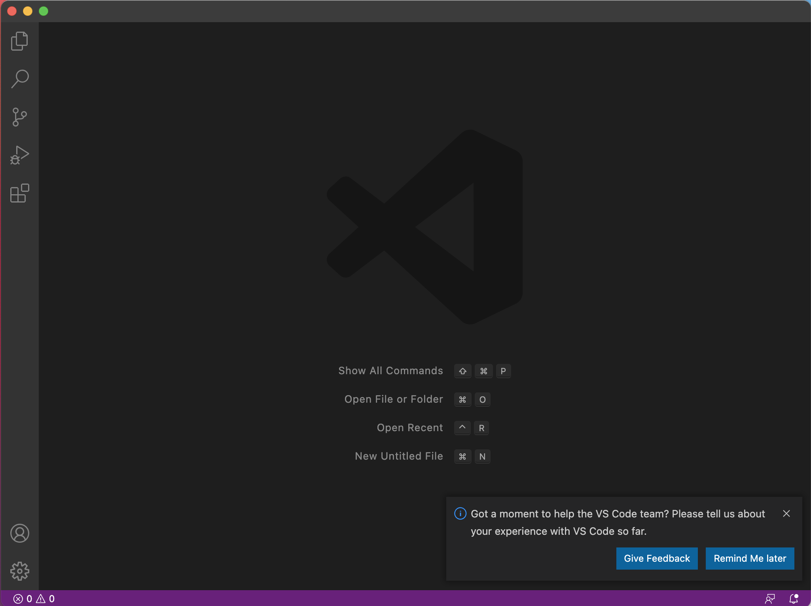
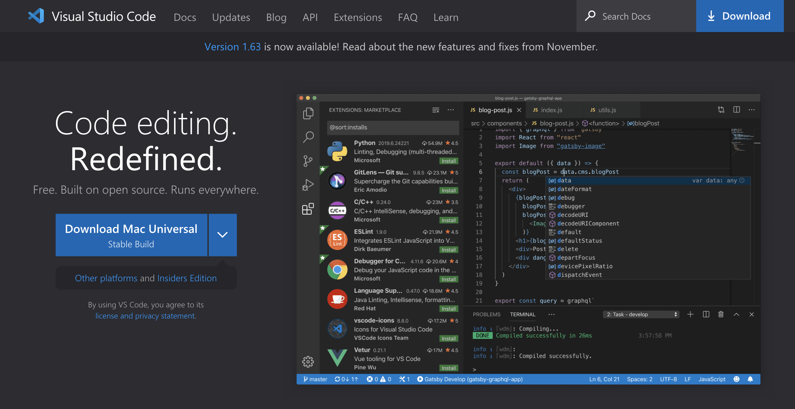

# Week 2 Lab 1 Report:

Test Links:

[Lab Report 1](lab-report-1-week-2.html)

[Lab Report 1](https://lbryton.github.io/cse15l-lab-reports/lab-report-1-week-2.html)

1. Setting up Visual Studio Code

> Go to this [*link*](https://code.visualstudio.com/) to download the Visual Studio Code version for your operating system (OSX for Macs and Windows for PCs). This page should appear:

After downloading and installing Visual Studio, open up the application, and you should be prompted with this screen:

2. Remotely Connecting to CSE course-specific accounts

>To remotely connect to your CSE course-specific account, you will have to go to this [*link*](https://sdacs.ucsd.edu/~icc/index.php). 

After signing in with your UC San Diego username and PID, you will find your course-specific account under **Additional Accounts**. Your account username may include the specific class and quarter you are taking this class. To use this account, you will have to create a password. When you change your password, make sure you pick only to change the course account. Otherwise, you will also change your passwords for your TritonLink account.

3. Running Some Commands

4. Moving Files with **scp**

5. Setting up an SSH Key

6. Optimizing Remote Running

