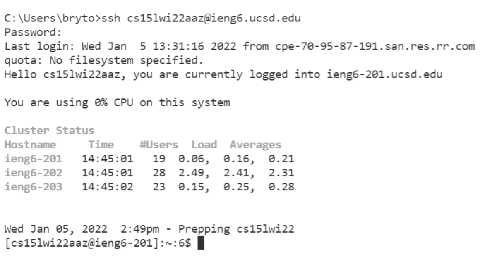
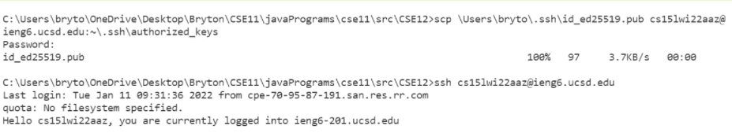

# Week 2 Lab 1 Report:

Test Links:

[Lab Report 1](lab-report-1-week-2.html)

[Lab Report 1](https://brytonlee5.github.io/cse15l-lab-reports/lab-report-1-week-2.html)

1. Setting up VS Code

> Download VS cod at this [link](https://code.visualstudio.com/). 

2. Remotely Connecting to CSE course-specific accounts.

3. Running Some Commands

4. Moving Files with **scp**

5. Setting up an SSH Key

6. Optimizing Remote Running

